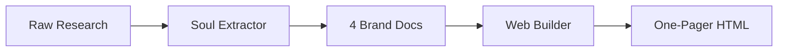

# Customer Webpage — Brand-to-Web Pipeline

Two-phase pipeline that transforms raw business research into a complete brand website.

**Phase 1 — Soul Extractor:** Takes messy raw research and produces four structured brand documents.  
**Phase 2 — Web Builder:** Takes those four documents and generates a single-file website that digitally translates the brand.

---

## How It Works



### Phase 1: Soul Extractor

Feed the `Soul-extractor_template.md` prompt into a capable LLM with all your raw research files. It produces:

| Output File | Contains |
|-------------|----------|
| `[slug]_soul.md` | Identity, tagline, personality, tone of voice, positioning |
| `[slug]_visual.md` | Color palette (HEX), typography, photography direction, materials |
| `[slug]_operations.md` | Address, hours, menu/services, price range, amenities |
| `[slug]_experience.md` | Real customer quotes, key attributes, honest criticism |

**Zero duplication** between documents — each piece of information appears in exactly one file.

### Phase 2: Web Builder

Feed the `web-prompt_template.md` prompt into an LLM with the four brand documents + image folder. It produces:

- A **single self-contained `.html` file** (inline CSS + JS)
- Editorial design, not a generic marketing template
- Responsive (375px / 768px / 1440px)
- Palette and typography strictly from `*_visual.md`
- Local images with relative paths — opens from filesystem

---

## Quick Start

1. **Gather sources** — Put all research files (AI reports, Google Maps data, reviews, brand notes, photos) in one folder.

2. **Run Soul Extractor** — Paste `Soul-extractor_template.md` into Claude/GPT-4 and attach your source files. Save the four output `.md` files.

3. **Run Web Builder** — Paste `web-prompt_template.md` into a session with filesystem access and the `frontend-design` skill. Point it to the four docs + image folder.

4. **Result** — `[prefix]_web_v1.html` ready to open in any browser.

---

## Supported Inputs

- `.md`, `.txt`, `.pdf` files from any source
- AI reports (Perplexity, Grok, ChatGPT)
- Google Maps info + reviews
- TripAdvisor, Facebook, Instagram exports
- Photo folders (referenced by path)

---

## Requirements

- A capable LLM (Claude, GPT-4, or equivalent)
- Filesystem access for the LLM session (Phase 2)
- `frontend-design` skill activated for Phase 2 (install if not available)

---

## Project Structure

```
Customer_webpage/
├── README.md
├── REDMINE.md                    # Full task breakdown & project plan
├── Soul-extractor_template.md    # Phase 1 prompt
└── web-prompt_template.md        # Phase 2 prompt
```

---

## Key Principles

- **No invented data** — If it's not in the sources, it doesn't appear in the output
- **Verbatim quotes** — Customer reviews are never paraphrased
- **Honest criticism included** — Weaknesses are documented, not hidden
- **Brand-faithful design** — The website feels like the physical space, not a template
