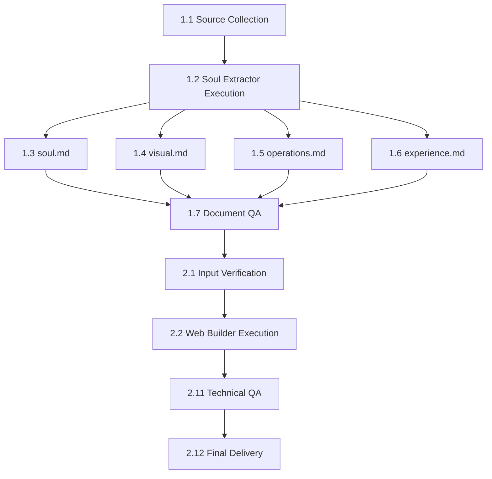

# Project: Customer Webpage — Brand-to-Web Pipeline

## Project Description

Two-phase automated pipeline to transform raw business research into a complete brand website. Phase 1: brand soul extraction and structuring. Phase 2: one-pager website generation from the structured documents.

**Repository:** `Customer_webpage/`  
**Status:** In development  
**Priority:** High  

---

## Epic 1 — Soul Extractor (Brand Extraction)

### Description
Prompt template that transforms raw research (AI reports, Google Maps data, reviews, photos, brand notes) into four structured `.md` documents with zero duplication between them.

---

### Task 1.1 — Source Collection
| Field | Value |
|-------|-------|
| **Tracker** | Task |
| **Status** | New |
| **Priority** | High |
| **Assigned to** | Operator / Researcher |

**Description:**  
Gather all source files for the business into a single folder:
- Perplexity, Grok, or other AI reports
- Google Maps data (info + reviews)
- Photo descriptions / image folder
- Existing brand notes / brand guidelines
- TripAdvisor, Facebook, Instagram exports

**Acceptance criteria:**
- [ ] All source files gathered in a single folder
- [ ] Supported formats: `.md`, `.txt`, `.pdf`
- [ ] Image folder referenced if it exists

---

### Task 1.2 — Soul Extractor Execution
| Field | Value |
|-------|-------|
| **Tracker** | Task |
| **Status** | New |
| **Priority** | High |
| **Assigned to** | AI Operator |
| **Depends on** | Task 1.1 |

**Description:**  
Run the `Soul-extractor_template.md` prompt in a capable LLM (Claude, GPT-4, etc.) feeding it all collected source files.

**Acceptance criteria:**
- [ ] LLM has read all source files before producing output
- [ ] No duplication between documents (each piece of data appears in exactly one)

---

### Task 1.3 — Generate `[slug]_soul.md`
| Field | Value |
|-------|-------|
| **Tracker** | Task |
| **Status** | New |
| **Priority** | High |
| **Assigned to** | AI Operator |
| **Depends on** | Task 1.2 |

**Description:**  
Brand identity document. Required sections:
- Who they are (2-3 paragraphs)
- Tagline + explanation
- Brand promise
- Personality (attribute/manifestation table, 4-6 rows)
- Tone of voice (with right/wrong example)
- Positioning (3-5 bullet points)
- Who it's for (portrait, not demographic)
- What it is not

**Acceptance criteria:**
- [ ] All sections present
- [ ] Analytical tone, not promotional
- [ ] Missing data marked as `[Not available in source material]`

---

### Task 1.4 — Generate `[slug]_visual.md`
| Field | Value |
|-------|-------|
| **Tracker** | Task |
| **Status** | New |
| **Priority** | High |
| **Assigned to** | AI Operator |
| **Depends on** | Task 1.2 |

**Description:**  
Visual direction document. Required sections:
- Color palette (Accent colors + Base colors with HEX + Golden rule)
- Typography (Display, Body, Recommended pairing)
- Visual language & photography (Key motifs + Photography direction)
- Materials & textures (table)
- Multisensory reference (paragraph)

**Acceptance criteria:**
- [ ] All colors with HEX code
- [ ] Dominance/accent golden rule defined
- [ ] Photography direction with 5-7 clear directives

---

### Task 1.5 — Generate `[slug]_operations.md`
| Field | Value |
|-------|-------|
| **Tracker** | Task |
| **Status** | New |
| **Priority** | High |
| **Assigned to** | AI Operator |
| **Depends on** | Task 1.2 |

**Description:**  
Operations document. Required sections:
- Business file (table with name, address, hours, phone, website, social media, capacity, price range, Google rating)
- Available services (confirmed amenities list)
- Menu / Main services (by category with notes)
- Location & surroundings (neighborhood context)
- Best times to visit (time/reason table)
- Service notes (quality patterns, weaknesses)

**Acceptance criteria:**
- [ ] All business file fields complete or marked as unavailable
- [ ] Contradictions between sources flagged
- [ ] Services/menu organized by category

---

### Task 1.6 — Generate `[slug]_experience.md`
| Field | Value |
|-------|-------|
| **Tracker** | Task |
| **Status** | New |
| **Priority** | High |
| **Assigned to** | AI Operator |
| **Depends on** | Task 1.2 |

**Description:**  
Customer experience document. Required sections:
- What customers feel (narrative synthesis)
- Phrases that define the place (5-8 real verbatim quotes)
- Most cited attributes (table with ★ frequency)
- Why people come back (4-6 real motivators)
- Real use cases
- The honest criticism (most mentioned complaint, unsoftened)
- The human detail (if present in sources)
- Writing guidelines (5-7 creative directives)

**Acceptance criteria:**
- [ ] Review quotes reproduced verbatim (never paraphrased)
- [ ] Honest criticism present and unsoftened
- [ ] Writing guidelines derived from reviews and atmosphere

---

### Task 1.7 — Document Review & QA
| Field | Value |
|-------|-------|
| **Tracker** | Task |
| **Status** | New |
| **Priority** | Medium |
| **Assigned to** | Reviewer |
| **Depends on** | Tasks 1.3, 1.4, 1.5, 1.6 |

**Description:**  
Verify quality of the four generated documents.

**Acceptance criteria:**
- [ ] Zero duplication across the four documents
- [ ] All verifiable data cross-checked against sources
- [ ] Contradictions correctly flagged
- [ ] Verbatim quotes are actually verbatim
- [ ] No invented data

---

## Epic 2 — Web Builder (Website Generation)

### Description
Prompt template that takes the four structured brand documents and generates a self-contained one-pager HTML website that digitally translates the brand's essence.

---

### Task 2.1 — Input Verification
| Field | Value |
|-------|-------|
| **Tracker** | Task |
| **Status** | New |
| **Priority** | High |
| **Assigned to** | Operator |
| **Depends on** | Task 1.7 |

**Description:**  
Confirm that all four brand documents are complete and the image folder is available.

**Acceptance criteria:**
- [ ] `*_soul.md` present and complete
- [ ] `*_visual.md` present with HEX palette defined
- [ ] `*_operations.md` present with complete business file
- [ ] `*_experience.md` present with attributes and quotes
- [ ] Image folder inspected and cataloged

---

### Task 2.2 — Web Builder Execution
| Field | Value |
|-------|-------|
| **Tracker** | Task |
| **Status** | New |
| **Priority** | High |
| **Assigned to** | AI Operator |
| **Depends on** | Task 2.1 |

**Description:**  
Run the `web-prompt_template.md` prompt in an LLM with code generation capability and `frontend-design` skill, feeding it the four brand documents and access to the image folder.

**Key rules:**
- Single self-contained `.html` file (inline CSS, inline JS)
- NOT a generic marketing landing — it's a digital brand translation
- Palette exclusively from `*_visual.md`
- Typography: Google Fonts, Inter/Roboto/Arial/system fonts banned
- Local images only with relative paths
- Responsive (375px, 768px, 1440px)
- Vanilla JS, no heavy frameworks (GSAP CDN allowed)
- Accessibility: contrast, alt, heading hierarchy, focus states

---

### Task 2.3 — Hero Section
| Field | Value |
|-------|-------|
| **Tracker** | Subtask |
| **Status** | New |
| **Priority** | High |
| **Parent** | Task 2.2 |

**Description:**  
Wordmark/name, discreet subtitle line, background image or texture. No loud button. Minimal nav.

---

### Task 2.4 — Anchor Phrase Section
| Field | Value |
|-------|-------|
| **Tracker** | Subtask |
| **Status** | New |
| **Priority** | Medium |
| **Parent** | Task 2.2 |

**Description:**  
If the brand has a tagline in `*_soul.md`, a dedicated full-screen section.

---

### Task 2.5 — Editorial Section (Who They Are)
| Field | Value |
|-------|-------|
| **Tracker** | Subtask |
| **Status** | New |
| **Priority** | High |
| **Parent** | Task 2.2 |

**Description:**  
Editorial block with 2-3 paragraphs from `*_soul.md` as prose, interleaved with images in asymmetric composition.

---

### Task 2.6 — Ratings & Attributes Section
| Field | Value |
|-------|-------|
| **Tracker** | Subtask |
| **Status** | New |
| **Priority** | High |
| **Parent** | Task 2.2 |

**Description:**  
TripAdvisor-style trust block with real data:
- **Left column:** Large score, unicode stars, total reviews + source
- **Right column top:** 5-8 attributes with animated bars + stars
- **Right column bottom:** "Good for" pills from real use cases

No shadows. No invented data.

---

### Task 2.7 — Offering/Menu Section
| Field | Value |
|-------|-------|
| **Tracker** | Subtask |
| **Status** | New |
| **Priority** | Medium |
| **Parent** | Task 2.2 |

**Description:**  
Curated selection from `*_operations.md`. Short descriptions. Prices only if aesthetically fitting.

---

### Task 2.8 — Human Detail Section
| Field | Value |
|-------|-------|
| **Tracker** | Subtask |
| **Status** | New |
| **Priority** | Low |
| **Parent** | Task 2.2 |

**Description:**  
If the brief identifies a strong human detail (staff, founder, ritual, community), a brief dedicated section.

---

### Task 2.9 — Visit/Contact Section
| Field | Value |
|-------|-------|
| **Tracker** | Subtask |
| **Status** | New |
| **Priority** | High |
| **Parent** | Task 2.2 |

**Description:**  
Practical data from `*_operations.md`: address, hours, phone, best times, social links. Optional map embed.

---

### Task 2.10 — Footer
| Field | Value |
|-------|-------|
| **Tracker** | Subtask |
| **Status** | New |
| **Priority** | Low |
| **Parent** | Task 2.2 |

**Description:**  
Minimal: wordmark, one line, discreet credits.

---

### Task 2.11 — Technical & Visual QA
| Field | Value |
|-------|-------|
| **Tracker** | Task |
| **Status** | New |
| **Priority** | High |
| **Assigned to** | Reviewer |
| **Depends on** | Task 2.2 |

**Description:**  
Review of the generated HTML.

**Acceptance criteria:**
- [ ] Single self-contained `.html` file
- [ ] Correct responsive at 375px, 768px, 1440px
- [ ] Images with `loading="lazy"` and descriptive `alt`
- [ ] Sufficient contrast (WCAG AA minimum)
- [ ] Correct heading hierarchy
- [ ] Visible focus states
- [ ] No invented data — everything traceable to the 4 input docs
- [ ] Palette respects `*_visual.md` (accents as accents, not as backgrounds)
- [ ] Typography loaded from Google Fonts, no banned fonts
- [ ] Animations consistent with brand tone
- [ ] No image forced into incorrect section

---

### Task 2.12 — Final Delivery
| Field | Value |
|-------|-------|
| **Tracker** | Task |
| **Status** | New |
| **Priority** | High |
| **Assigned to** | Operator |
| **Depends on** | Task 2.11 |

**Description:**  
Save file as `[brief-prefix]_web_v1.html` in the project directory with images referenced by relative path.

**Acceptance criteria:**
- [ ] Filename follows `[prefix]_web_v1.html` convention
- [ ] Opens correctly from filesystem (no server needed)
- [ ] Images load via relative path

---

## Dependency Summary

---

## Project Notes

- **Full flow per client:** ~2 operative hours (collection + 2 AI executions + 2 reviews)
- **Scalability:** The pipeline is replicable for any business. Only the source folder changes.
- **Risks:** Output quality depends on the quality/quantity of sources. Businesses with few reviews will produce documents with more gaps.
- **Required tools:** Capable LLM (Claude/GPT-4), filesystem access, `frontend-design` skill for Phase 2.
